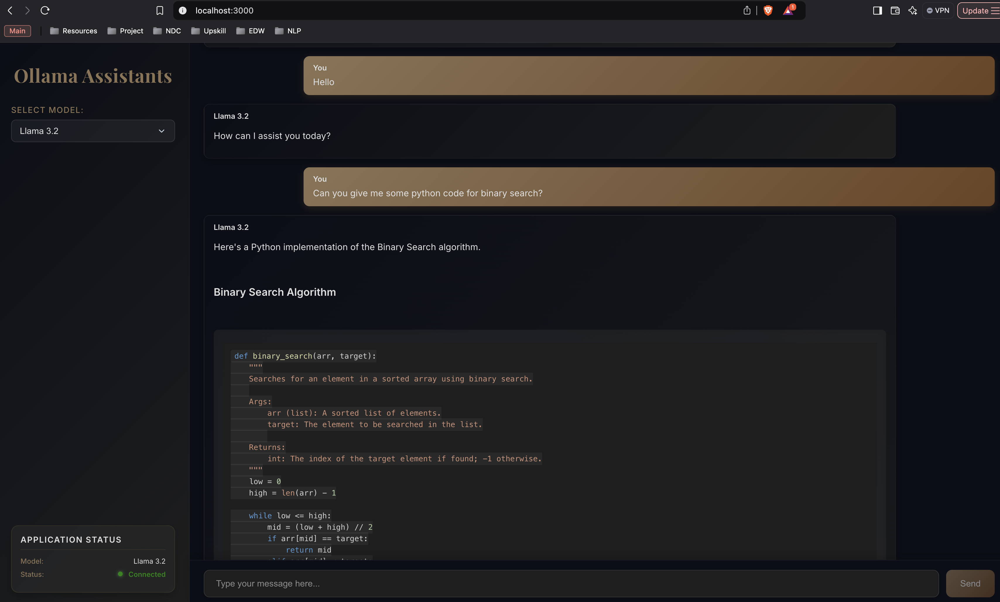

# Setup Local LLM Hub
- A repository that provides a comprehensive guide and code to install open-sourced LLMs on the local machine, and interact with them on the terminal.

## Project Structure

```
setup-local-llm-hub/
|___src/
│   |__install.py            # Script to install Ollama
│   |__download_models.py    # Script to download models
│   |__interact.py           # Script to interact with models
│   |__api_client.py         # Ollama API client example
|___model_list.json          # List of models to download
|___requirements.txt         # List of Python dependencies to download
|___README.md                # This file
```

## Getting Started

Note: Make sure to change the project directory to "setup-local-llm-hub/" in the above case before running the following commands.

1. Make sure you have Python 3.6+ installed (requirements.txt uses Python 3.12)
   - Create Virtual Environment - `conda create -p .venv python=3.12 -y`
   - Activate the .venv
   - pip install -r requirements.txt

2. Install Ollama on your system
   - Install Ollama: `python src/install.py`
   - Run `ollama serve` in a separate terminal to start ollama before executing the below steps.

3. Download the desired model(s)
   - Download models: `python src/download_models.py`
   - Enter the number for the desired model.

4. Check all the installed models
   - List installed models: `ollama list`

5. Start a quick chat with the model through the terminal
   - Interact with models: `python src/interact.py`
   - Select the model
   - Use `/bye` to exit the chat and `quit` or `exit` to exit from the interaction.

6. To Use UI Interaction
   - Navigate to the directory - `cd ollama-server`
   - Start the Backend in terminal 1 - `python ollama_server.py`
   - Navigate to frontend directory - `cd frontend`
   - Start the Frontend in terminal 2- `npm start`
   - You should be able to see the UI at "http://localhost:3000/"

## UI


## Available Models

By default, this project is configured to download:
- Mistral (7B) - Mistral AI's open source model (7B parameters)
- Deep Seek R1 (7B) - Deep Seek's mini model
- Llama 3.2 (3B) - Meta's Llama 3 model (3B parameters)
- Gemma 2 (2B) - Google's mini model

- Add more models:
   - Use the README.md from the GitHub for Ollama - https://github.com/ollama/ollama to see the available models.
   - Identify the model, parameters, and commands and modify the `model_list.json` file to add or remove models.

## Requirements

- Python 3.6+
- Install dependencies from requirements.txt (mentioned in step 2 of the getting started section)
- Ollama (will be installed by the script in step 2 of the getting started section)

## Additional Information
For more information about Ollama, visit https://ollama.com/
Github for Ollama - https://github.com/ollama/ollama

## Next Steps:
- Implement a generic react UI to select and interact with the model using web sockets.
